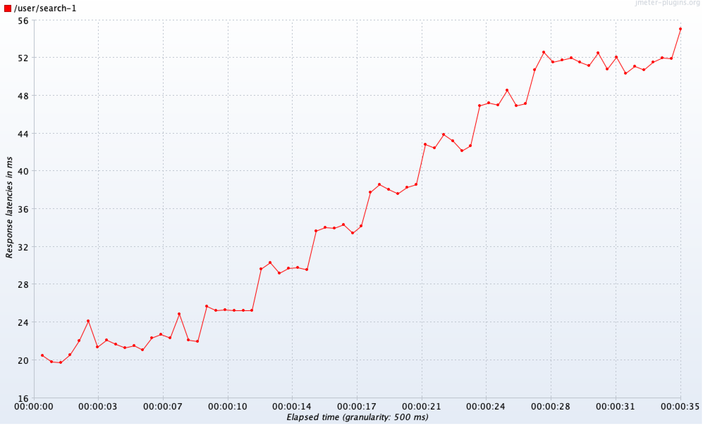

# Indexes: Query Optimization

Query for searching profiles by first and last name prefix

```sql
SELECT U.id, U.firstName, U.secondName, U.birthdate, U.gender, U.biography, U.city
FROM user AS U
WHERE firstName LIKE $1 and secondName LIKE $2
ORDER BY U.id
```

The GIN index supports partial match searches, is also used to implement full-text searches, and supports the pg_trgm extension, which helps you efficiently search across different forms of text.

```sql
CREATE INDEX first_name_second_name ON user USING GIN(firstName gin_trgm_ops, secondName gin_trgm_ops);
```

EXPLAIN request

```sql
EXPLAIN SELECT * FROM "user" WHERE firstname LIKE 'Аб%' AND secondname LIKE 'Ро%' ORDER BY id;
QUERY PLAN                                               
--------------------------------------------------------------------------------------------------------
 Sort  (cost=55.27..55.27 rows=1 width=344)
   Sort Key: id
   ->  Bitmap Heap Scan on "user"  (cost=51.24..55.26 rows=1 width=344)
         Recheck Cond: (((firstname)::text ~~ 'Аб%'::text) AND ((secondname)::text ~~ 'Ро%'::text))
         ->  Bitmap Index Scan on first_name_second_name  (cost=0.00..51.24 rows=1 width=0)
               Index Cond: (((firstname)::text ~~ 'Аб%'::text) AND ((secondname)::text ~~ 'Ро%'::text))
(6 rows)

```


## 1 request

### Before adding the index:


### After adding the index:


## 10 requests

### Before adding the index:


### After adding the index:



## 100 requests

### Before adding the index:


### After adding the index:


## 1000 requests

### Before adding the index:


### After adding the index:


